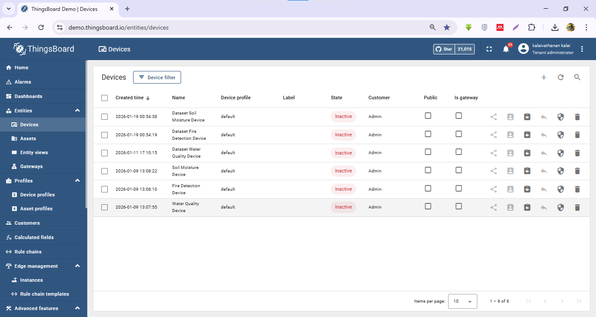
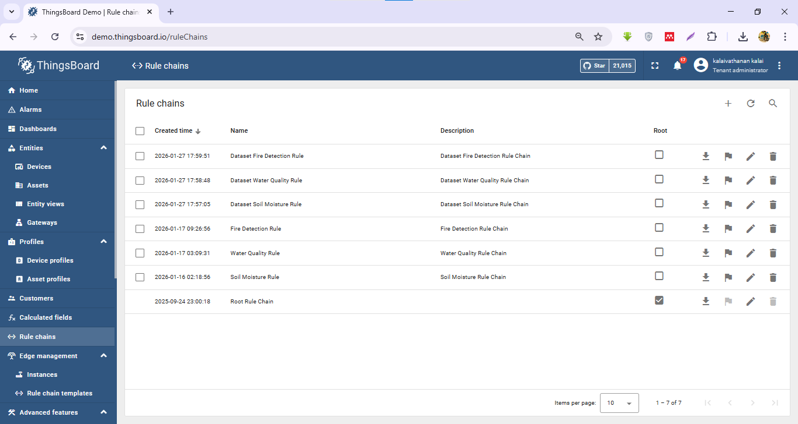
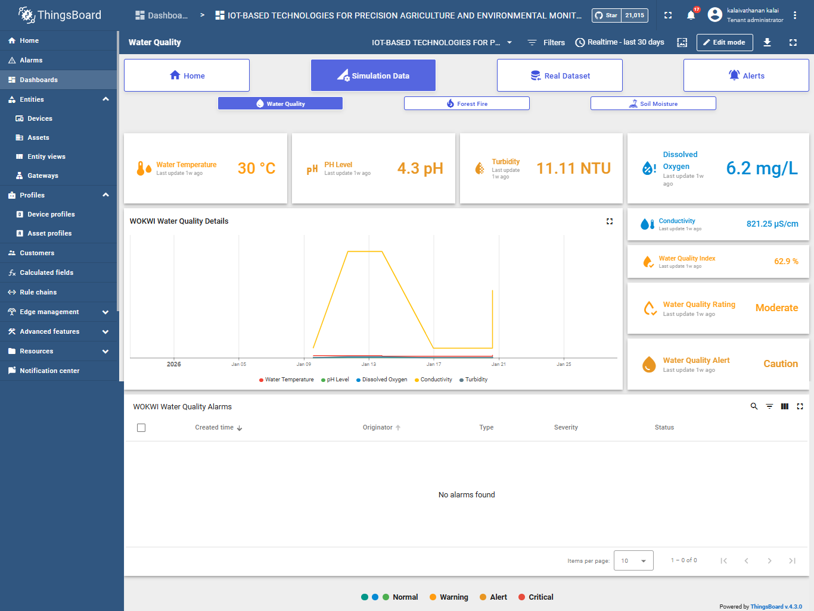

# Integrated IoT Environmental Monitoring  
## ESP32 (Wokwi) + ThingsBoard Cloud

This project implements an **IoT-based monitoring system** using **ESP32 microcontrollers (simulated in Wokwi)** integrated with **ThingsBoard Cloud** via **MQTT**.

The system supports **precision agriculture and environmental monitoring** across three domains:
- 🌱 Soil Moisture Monitoring
- 🔥 Fire Detection
- 💧 Water Quality Monitoring

The project includes:
- Wokwi ESP32 source code and circuit diagrams
- ThingsBoard dashboards, rule chains, and device profiles (exported)
- Dataset-based simulations and real-time telemetry
- Screenshots and documentation for device setup

---

## 📌 Dashboard Name

**IOT-BASED TECHNOLOGIES FOR PRECISION AGRICULTURE AND ENVIRONMENTAL MONITORING**

---

## 🔗 Live Demo Access

### ThingsBoard Cloud Platform
- **Platform URL:** https://demo.thingsboard.io/login
- **Username:** demo_iot@gmail.com
- **Password:** Demo@123

> ⚠️ This is a demo account for academic evaluation purposes only.

---

### Wokwi Simulation Links

Direct access to ESP32 simulations for each monitoring domain:

| System | Wokwi Simulation Link |
|--------|----------------------|
| 🌱 **Precision Irrigation** | [Open Simulation](https://wokwi.com/projects/444647324346462209) |
| 🔥 **Forest Fire Detection** | [Open Simulation](https://wokwi.com/projects/449427273137373185) |
| 💧 **Water Quality Monitoring** | [Open Simulation](https://wokwi.com/projects/443454484662335489) |

> 💡 **Tip:** Click "▶ Play" in each Wokwi simulation to observe real-time sensor behavior and MQTT data transmission.

---


## 🛠️ Project Structure

```
├── thingsboard/
│   ├── dashboard/             # Dashboard configuration exports
│   ├── device-profiles/       # Device profile definitions
│   ├── rule-chains/           # Alert and processing logic
│   └── screenshots/           # Platform interface captures
├── wokwi/
│   ├── soil-moisture/         # Precision irrigation firmware
│   │   ├── soil-moisture.ino
│   │   └── diagram.json
│   ├── fire-detection/        # Forest fire detection firmware
│   │   ├── fire-detection.ino
│   │   └── diagram.json
│   └── water-quality/         # Water quality monitoring firmware
│       ├── water-quality.ino
│       └── diagram.json
└── data/
    └── datasets/              # Validation datasets
        
```
---

## 📸 Screenshots & Visual Documentation

<details>
<summary><b>📱 Click to view Device List</b></summary>



**Configured Devices:**
- ✅ Dataset Soil Moisture Device
- ✅ Dataset Fire Detection Device
- ✅ Dataset Water Quality Device
- ✅ Soil Moisture Device (Wokwi)
- ✅ Fire Detection Device (Wokwi)
- ✅ Water Quality Device (Wokwi)

</details>

<details>
<summary><b>⚙️ Click to view Rule Chains</b></summary>



**Active Rule Chains:**
- Root Rule Chain (main processing)
- Soil Moisture Rule Chain
- Fire Detection Rule Chain
- Water Quality Rule Chain
- Dataset processing chains

</details>

<details>
<summary><b>🎛️ Click to view Dashboard</b></summary>



**Dashboard Features:**
- Real-time telemetry for all sensors
- Alert status indicators
- Historical data charts
- Mobile-responsive layout

</details>

---

## 📋 Prerequisites

### For Evaluators (View Only)
- Web browser (Chrome/Firefox/Safari recommended)
- Internet connection
- ThingsBoard account credentials provided above

### For Full Reproduction
- Python 3.7+ with pip
- ThingsBoard Cloud account (or local installation)
- Wokwi account (free)
- Git (for cloning repository)

### Python Dependencies
```bash
pip install pandas requests
```
---

## 🚀 Quick Start (Recommended for Evaluators)

### Option A: View Live ThingsBoard Dashboard (Fastest)

1. **Login to ThingsBoard:**
   - Navigate to: https://demo.thingsboard.io/login
   - Username: `demo_iot@gmail.com`
   - Password: `Demo@123`

2. **Access Main Dashboard:**
   - Go to **Dashboards** → **IoT-Based Technologies for Precision Agriculture and Environmental Monitoring**
   - Explore tabs: **Simulation**, **Real Dataset**, **Alerts**

3. **View Real-Time Data:**
   - Observe telemetry widgets for all three monitoring domains
   - Check color-coded status indicators (Green: Normal, Yellow: Caution, Red: Alert)
   - Review historical trends in time-series charts

### Option B: Run Wokwi Simulations

1. **Open Simulation:**
   - Choose any monitoring system link from the table above
   - Wokwi simulation will load in your browser

2. **Start ESP32:**
   - Click **▶ Start Simulation**
   - Monitor serial output for WiFi connection and MQTT status
   - Observe sensor readings updating every 30-60 seconds

3. **View in ThingsBoard:**
   - Login to ThingsBoard (credentials above)
   - Data from simulation appears in dashboard within 5 seconds
   - Test alert triggers by modifying sensor values in Wokwi

### Option C: Explore Mobile Dashboard

1. **Install ThingsBoard App:**
   - iOS: [App Store](https://apps.apple.com/app/thingsboard/id1594355695)
   - Android: [Google Play](https://play.google.com/store/apps/details?id=org.thingsboard.demo.app)

2. **Login:**
   - Server: `https://demo.thingsboard.io`
   - Use same credentials as desktop access

3. **Receive Push Notifications:**
   - Enable notifications when prompted
   - Alerts trigger automatically based on sensor thresholds

---

## ⚙️ ThingsBoard Setup (Full Reproduction)

### 1️⃣ Import Rule Chains (IMPORTANT ORDER)

Import rule chains in the following order:


1. **Wokwi Rule Chains**  
   ```
   - soil_moisture_rule.json  
   - fire_detection_rule.json  
   - water_quality_rule.json
   ```
2. **Dataset Rule Chains**  
   ```
   - dataset_soil_moisture_rule.json
   - dataset_fire_detection_rule.json
   - dataset_water_quality_rule.json
   ```

3. **Root Rule Chain**  
   ```
   root-rule-chain.json
   ```

Ensure the **Root Rule Chain** is connected to all child rule chains.

---

### 2️⃣ Import Device Profiles
1. Go to **Profiles → Device Profiles**
2. Click **Import**
3. Upload:
   ```
   thingsboard/device-profiles/default.json
   ```

---

### 3️⃣ Device Creation (Manual Step)

ThingsBoard does **not support exporting devices**, therefore devices must be created manually.

### Required Device Names (EXACT)

#### Dataset Devices
- Dataset Soil Moisture Device  
- Dataset Fire Detection Device  
- Dataset Water Quality Device  

#### Live Wokwi Devices
- Soil Moisture Device  
- Fire Detection Device 
- Water Quality Device 

📷 Reference screenshot:
```
thingsboard/screenshots/Devices-list.png
```

---

### 4️⃣ Import Dashboard
1. Go to **Dashboards → Import Dashboard**
2. Upload:
   ```
   thingsboard/dashboard/iot_based_technologies_for_precision_agriculture_and_environmental_monitoring.json
   ```

---

## 🔑 Device Credentials (MQTT)

For each device:
1. Open the device in ThingsBoard
2. Go to **Credentials**
3. Copy the **Access Token**

---

## 🧪 Wokwi Code Configuration

Edit the relevant `.ino` file:

```cpp
#define WIFI_SSID "Wokwi-GUEST"
#define WIFI_PASSWORD ""

#define THINGSBOARD_SERVER "<YOUR_THINGSBOARD_HOST>"
#define TOKEN "<DEVICE_ACCESS_TOKEN>"
```

Files:
- wokwi/soil-moisture/Soil Moisture with thingsboard.ino
- wokwi/fire-detection/Fire Detection with thingsboard.ino
- wokwi/water-quality/water quality with thingsboard.ino

Click **▶ Play** in Wokwi to start telemetry transmission.

---

## 📊 Dataset-Based Simulation

CSV datasets are stored in:
```
data/datasets/
```

These datasets are processed using ThingsBoard rule chains for analysis and visualization.

### Python Scripts for Dataset Management

Two Python scripts are provided to manage and upload historical data:

#### 1️⃣ Update Timestamps (`update_timestamps.py`)

This script updates CSV timestamps to match your desired date range and intervals.

**Usage:**
```bash
python update_timestamps.py
```

**Configuration:**
```python
# Irrigation System (60-second intervals)
update_csv_timestamps(
    input_file="irrigation_dataset.csv",
    output_file="irrigation_2026_60s.csv",
    start_date="2026-01-27 12:40:00",
    interval_seconds=60
)

# Fire Detection (30-second intervals)
update_csv_timestamps(
    input_file="fire_detection_dataset.csv",
    output_file="fire_detection_2026_30s.csv",
    start_date="2026-01-27 12:40:00",
    interval_seconds=30
)

# Water Quality (45-second intervals)
update_csv_timestamps(
    input_file="water_quality_dataset.csv",
    output_file="water_quality_2026_45s.csv",
    start_date="2026-01-27 12:40:00",
    interval_seconds=45
)
```

**Required Python packages:**
```bash
pip install pandas
```

---

#### 2️⃣ Upload to ThingsBoard (`upload_to_thingsboard.py`)

This script uploads CSV data to ThingsBoard devices via REST API.

**Usage:**
```bash
python upload_to_thingsboard.py
```

**Interactive Menu:**
```
1. Irrigation System
2. Fire Detection
3. Water Quality
4. ALL THREE (one after another)
0. Exit
```

**Configuration:**
```python
# ThingsBoard Server
THINGSBOARD_HOST = "demo.thingsboard.io"

# Device Tokens (from ThingsBoard device credentials)
IRRIGATION_TOKEN = "YOUR_DEVICE_TOKEN"
FIRE_TOKEN = "YOUR_DEVICE_TOKEN"
WATER_QUALITY_TOKEN = "YOUR_DEVICE_TOKEN"

# CSV Files
IRRIGATION_CSV = "irrigation_2026_60s.csv"
FIRE_CSV = "fire_detection_2026_30s.csv"
WATER_QUALITY_CSV = "water_quality_2026_45s.csv"

# Upload delay between rows
UPLOAD_DELAY = 0.5  # seconds
```

**Required Python packages:**
```bash
pip install pandas requests
```

**Features:**
- Progress tracking during upload
- Error handling and retry logic
- Upload statistics (success/fail counts)
- Configurable delay between uploads
- Historical timestamp preservation

---

### Dataset Upload Workflow

1. **Prepare datasets** with original timestamps
2. **Run `update_timestamps.py`** to adjust dates and intervals
3. **Configure device tokens** in `upload_to_thingsboard.py`
4. **Run `upload_to_thingsboard.py`** and select dataset(s)
5. **Monitor progress** in console output
6. **Verify data** in ThingsBoard dashboard

---

## 🔐 Security Notice

- Demo credentials are provided **only for academic evaluation**
- Read-only access prevents system modification
- No personal or confidential data stored
- All telemetry data is simulated or from public datasets
- TLS encryption enabled for MQTT communication
- Role-based access control implemented

---

## 👨‍🎓 Author

**Student:** Kalaivathanan  
**Institution:** York St John London University
**Module:** COM7040M – Dissertation  
**Academic Year:** 2025-2026  

**Project Title:** *IoT-Based Technologies for Precision Agriculture and Environmental Monitoring*


---

## 📄 License

This project is developed for academic purposes as part of an MSc Dissertation at York St John University.

**Academic Use:** Permitted with proper citation  
**Commercial Use:** Contact author for licensing inquiries  
**Reproduction:** Encouraged for educational and research purposes with attribution

---

## 🔧 Troubleshooting

### Wokwi Simulation Not Connecting
- Ensure simulation is running (green play button)
- Check serial monitor for connection errors
- Verify device token matches ThingsBoard credentials

### Dashboard Shows No Data
- Confirm device is online in ThingsBoard
- Check device credentials are correctly configured
- Wait 30-60 seconds for first data transmission

### Python Script Upload Fails
- Verify device tokens are correct
- Check network connectivity
- Ensure CSV files exist in correct directory

---

## 📞 Support & Feedback

### For Evaluators
- Technical questions: Use GitHub Issues
- Dashboard access problems: Contact via email
- Additional documentation: Check `/docs` folder

### For Researchers
- Dataset requests: Available upon reasonable request
- Replication support: Full source code provided in repository

---

**Last Updated:** February 2026  
**Repository:** [https://github.com/kalaivathanan/Yorksj_Msc_Dissertation](https://github.com/kalaivathanan/Yorksj_Msc_Dissertation)  
**Documentation Version:** 1.0 (Detailed)